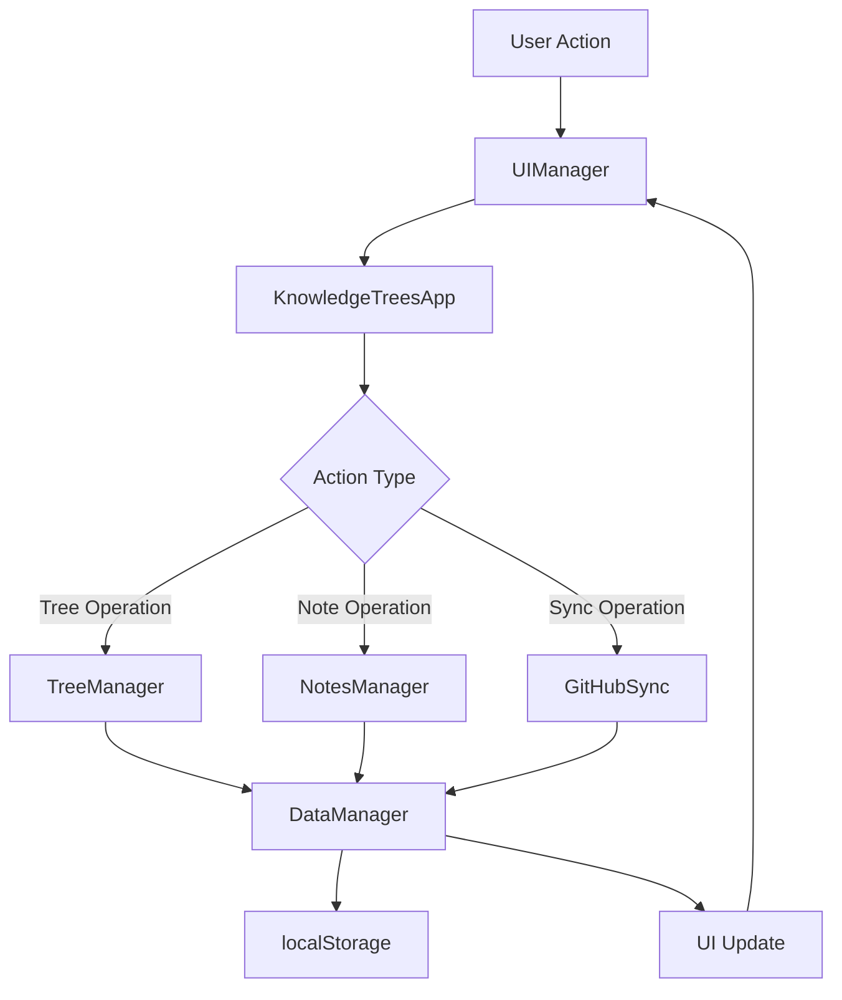

# 🏗️ Архитектура Knowledge Trees App v2.0

## 📋 Обзор

Knowledge Trees App v2.0 построено на модульной архитектуре, которая обеспечивает:
- **Масштабируемость** - легко добавлять новые функции
- **Поддерживаемость** - код разделен на логические модули
- **Тестируемость** - каждый модуль можно тестировать отдельно
- **Переиспользование** - модули можно использовать в других проектах

## 📁 Структура проекта

```
knowledge-trees-app/
├── package.json                 # Метаданные и зависимости
├── README.md                   # Основная документация
├── .gitignore                  # Git исключения
├── /src/                       # Исходный код
│   ├── index.html             # Главная HTML страница
│   ├── /js/                   # JavaScript модули
│   │   ├── app.js            # Точка входа приложения
│   │   ├── /core/            # Основная бизнес-логика
│   │   ├── /ui/              # Пользовательский интерфейс
│   │   ├── /sync/            # Синхронизация с внешними сервисами
│   │   ├── /utils/           # Утилиты и вспомогательные функции
│   │   └── /config/          # Конфигурация и настройки
│   ├── /css/                 # Модульные стили
│   │   ├── /base/           # Базовые стили и переменные
│   │   ├── /components/     # Стили компонентов
│   │   ├── /layout/         # Стили макета
│   │   └── /themes/         # Темы оформления
│   └── /templates/          # HTML шаблоны
├── /assets/                 # Статические ресурсы
├── /docs/                   # Документация
├── /tests/                  # Тесты
└── /examples/               # Примеры использования
```

## 🧩 Модули приложения

### 1. Core Modules (Основные модули)

#### **KnowledgeTreesApp** (`/src/js/core/KnowledgeTreesApp.js`)
- **Назначение**: Главный класс приложения, координирует работу всех модулей
- **Ответственность**: 
  - Инициализация приложения
  - Координация между модулями
  - Обработка пользовательских событий
  - Управление жизненным циклом приложения

#### **DataManager** (`/src/js/core/DataManager.js`)
- **Назначение**: Управление данными и их хранением
- **Ответственность**:
  - CRUD операции с данными
  - Работа с localStorage
  - Валидация данных
  - Кэширование

#### **TreeManager** (`/src/js/core/TreeManager.js`)
- **Назначение**: Управление деревьями знаний
- **Ответственность**:
  - Создание, редактирование, удаление деревьев
  - Управление узлами дерева
  - Операции с иерархической структурой
  - Подсчет статистики деревьев

#### **NotesManager** (`/src/js/core/NotesManager.js`)
- **Назначение**: Управление заметками
- **Ответственность**:
  - CRUD операции с заметками
  - Работа с тегами
  - Поиск и фильтрация заметок
  - Архивирование заметок

### 2. UI Modules (Модули интерфейса)

#### **UIManager** (`/src/js/ui/UIManager.js`)
- **Назначение**: Управление пользовательским интерфейсом
- **Ответственность**:
  - Рендеринг списков элементов
  - Обработка пользовательских действий
  - Управление состоянием интерфейса
  - Показ уведомлений

### 3. Sync Modules (Модули синхронизации)

#### **GitHubSync** (`/src/js/sync/GitHubSync.js`)
- **Назначение**: Синхронизация с GitHub
- **Ответственность**:
  - Аутентификация с GitHub API
  - Загрузка и выгрузка данных
  - Управление репозиториями
  - Обработка ошибок API

### 4. Utils Modules (Утилиты)

#### **helpers.js** (`/src/js/utils/helpers.js`)
- Вспомогательные функции общего назначения
- Работа с датами, строками, объектами
- Debounce, throttle функции

#### **validators.js** (`/src/js/utils/validators.js`)
- Валидация данных
- Проверка форматов (email, URL, токены)
- Валидация структур данных

#### **encoding.js** (`/src/js/utils/encoding.js`)
- Кодирование и декодирование UTF-8
- Работа с Base64
- Обработка различных кодировок

### 5. Config Modules (Конфигурация)

#### **categories.js** (`/src/js/config/categories.js`)
- Определение категорий деревьев и заметок
- Иконки и цвета категорий
- Вспомогательные функции для работы с категориями

#### **settings.js** (`/src/js/config/settings.js`)
- Настройки приложения по умолчанию
- Ключи для localStorage
- API endpoints

## 🔄 Поток данных



## 🎯 Принципы архитектуры

### 1. **Разделение ответственности (Separation of Concerns)**
- Каждый модуль отвечает за конкретную область функциональности
- Минимальная связанность между модулями
- Четкие интерфейсы взаимодействия

### 2. **Модульность**
- Код разбит на независимые модули
- Возможность переиспользования модулей
- Легкость тестирования отдельных компонентов

### 3. **Event-Driven Architecture**
- Модули взаимодействуют через события
- Слабая связанность компонентов
- Возможность легкого расширения функциональности

### 4. **Dependency Injection**
- Зависимости передаются через конструкторы
- Упрощение тестирования
- Гибкость конфигурации

## 📡 Система событий

Приложение использует пользовательские события для связи между модулями:

```javascript
// Запрос данных
document.dispatchEvent(new CustomEvent('requestItems', { 
    detail: { category: 'trees' } 
}));

// Выбор элемента
document.dispatchEvent(new CustomEvent('selectItem', { 
    detail: { id: 'item-id', category: 'trees' } 
}));

// Показ уведомления
document.dispatchEvent(new CustomEvent('showNotification', {
    detail: { message: 'Success!', type: 'success' }
}));
```

## 🔧 Расширение функциональности

### Добавление нового модуля

1. **Создайте файл модуля** в соответствующей папке
2. **Определите класс** с четкой ответственностью
3. **Добавьте импорт** в главный файл приложения
4. **Инициализируйте модуль** в KnowledgeTreesApp
5. **Добавьте обработчики событий** при необходимости

Пример:
```javascript
// /src/js/features/TagsManager.js
export class TagsManager {
    constructor(dataManager) {
        this.dataManager = dataManager;
    }
    
    createTag(name) {
        // Логика создания тега
    }
}

// В KnowledgeTreesApp.js
import { TagsManager } from '../features/TagsManager.js';

constructor() {
    // ...
    this.tagsManager = new TagsManager(this.dataManager);
}
```

### Добавление новой темы

1. **Создайте файл темы** в `/src/css/themes/`
2. **Определите CSS переменные** для цветов
3. **Добавьте импорт** в основной CSS файл
4. **Добавьте переключатель** в настройки

## 🧪 Тестирование

### Структура тестов
```
/tests/
├── /unit/                   # Модульные тесты
│   ├── DataManager.test.js
│   ├── TreeManager.test.js
│   └── NotesManager.test.js
├── /integration/            # Интеграционные тесты
│   ├── import-export.test.js
│   └── github-sync.test.js
└── /e2e/                    # End-to-end тесты
    └── user-flows.test.js
```

### Отладочные функции

Приложение предоставляет глобальные функции для отладки:

```javascript
// Проверка состояния приложения
testApp()

// Тестирование модулей
testModules()

// Тестирование боковой панели
testSidebar()

// Симуляция клика
debugClick('item-id')
```

## 📈 Производительность

### Оптимизации
- **Ленивая загрузка** модулей при необходимости
- **Кэширование** данных в DataManager
- **Debounce** для поисковых запросов
- **Виртуализация** для больших списков (планируется)

### Мониторинг
- Логирование производительности
- Отслеживание размера данных
- Мониторинг использования памяти

## 🔮 Планы развития

### Краткосрочные цели
- [ ] Добавление unit-тестов
- [ ] Система плагинов
- [ ] Улучшенная типизация (TypeScript)
- [ ] PWA функциональность

### Долгосрочные цели
- [ ] Реальное время синхронизации
- [ ] Совместная работа
- [ ] Мобильное приложение
- [ ] Интеграция с другими сервисами

## 📚 Дополнительные ресурсы

- [API Documentation](./API.md)
- [Contributing Guide](./CONTRIBUTING.md)
- [Deployment Guide](./DEPLOYMENT.md)
- [Changelog](./CHANGELOG.md)
